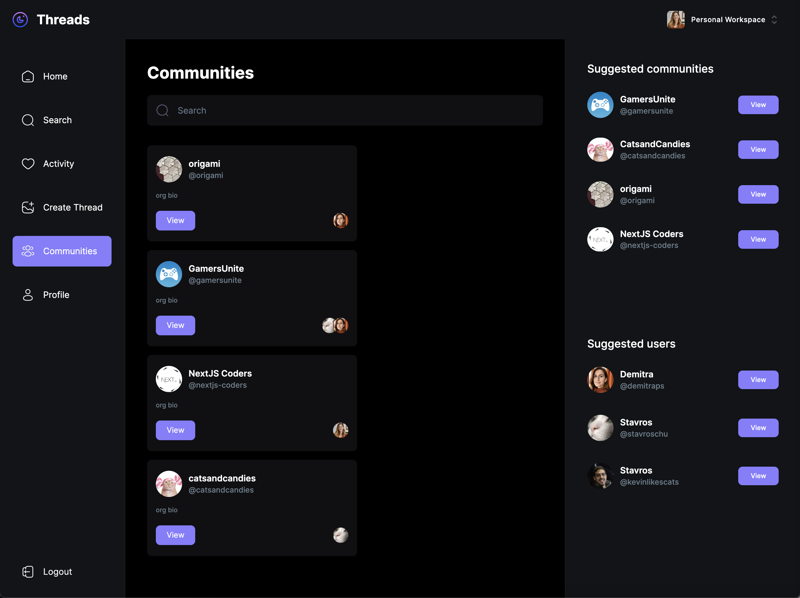

# Full Stack Next.js 13 Threads App | React, Next JS, TypeScript, MongoDB

This is a clone of the popular Threads App (META's Twitter).

## Features

- Create threads
- Reply/comment to threads
- View activity
- Search users
- Create communities
- Invite users to communities
- Search communities
- Post threads from communities
- User / Community profiles
   
## Tech Stack

**React, Next.JS 13, TypeScript, TailwindCSS**

**Authentication:** Clerk
**Data validation:** Zod
**FileUploads:** UploadThing
**Components:** Shadcn
**Database:** MongoDB with Mongoose ODM

## Demo


## Sign-in

You can sign in using any Google or Github account here:
https://threads-app-umber.vercel.app/sign-in


## Screenshots

Homepage:


Search:


Activity:


Create Thread:


Communities:



Profile page:


Single Community page:


Responsive design:


## To-Do List

- Create like and share options
- Activity notifications
- Follow requests
- Hashtags
- User tagging


### Prerequisites

**Node version 14.x**

### Cloning the repository

```bash
  git clone https://github.com/demitraps/threads-app-next13.git
```

### Start the app

```shell
npm run dev
```

## Available commands

Running commands with npm `npm run [command]`

| command         | description                              |
| :-------------- | :--------------------------------------- |
| `dev`           | Starts a development instance of the app |


